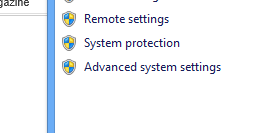
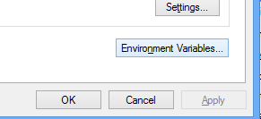
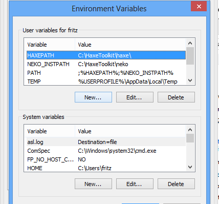
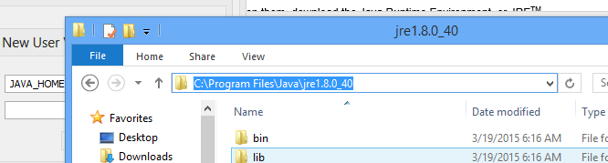
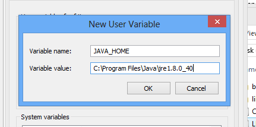
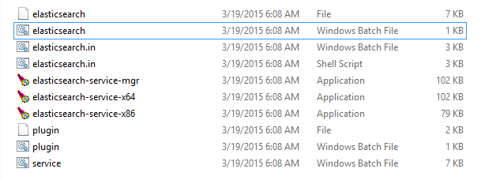

# help-astrid
astrid needs a databse.. i'll help out.

## Step 1 Install Java for Windows:

Go to http://www.oracle.com/technetwork/java/javase/downloads/jre8-downloads-2133155.html.

Select Windows x64 55.62 MB    jre-8u40-windows-x64.exe.
Install the fucker. Java in this case is the necessary evil, to come to beautiful enjoyment.

The JDK software is installed on your computer, for example, at `C:\Program Files\Java\jdk1.6.0_02`. You can move the JDK software to another location if desired.

Set `JAVA_HOME`:

Right click My Computer and select Properties.

On the Advanced tab, select Environment Variables, and then edit `JAVA_HOME` to point to where the JDK software is located, for example, `C:\Program Files\Java\jdk1.6.0_02`.

This is what that means:

## Step 2: Download / Unpack ElasticSearch
[Download this](https://download.elasticsearch.org/elasticsearch/elasticsearch/elasticsearch-1.4.4.zip)
Unpack this folder.
Go to the folder elasticsearch-1.4.4 and open the bin folder.
Double click elasticsearch (or elasticsearch.bat)
Looks like this:

## Step 3: Check if it works in Firefox / Chrome
Enter the address that opens up when you've doubleclicked elasticsearch:

## Step 4: Follow this tutorial and fill the bastard with data
http://joelabrahamsson.com/elasticsearch-101/
